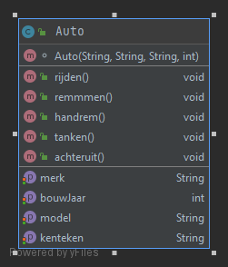

### Auto-Klasse
Voor deze opdracht heb ik de attributen merk, kenteken, model en bouwjaar gezet. Omdat
ik vind dat die de genoeg zijn om een auto te herkenen. Ik heb de attributen private 
gemaakt omdat dat meer netjes is en de geters en setters er bij gezet voor het ophalen 
en vervangen van informatie. Ik heb ook de basis methodes om een auto te rijden zoals 
remmen, rijden etc. 

 

### Klasse Extends klasse

